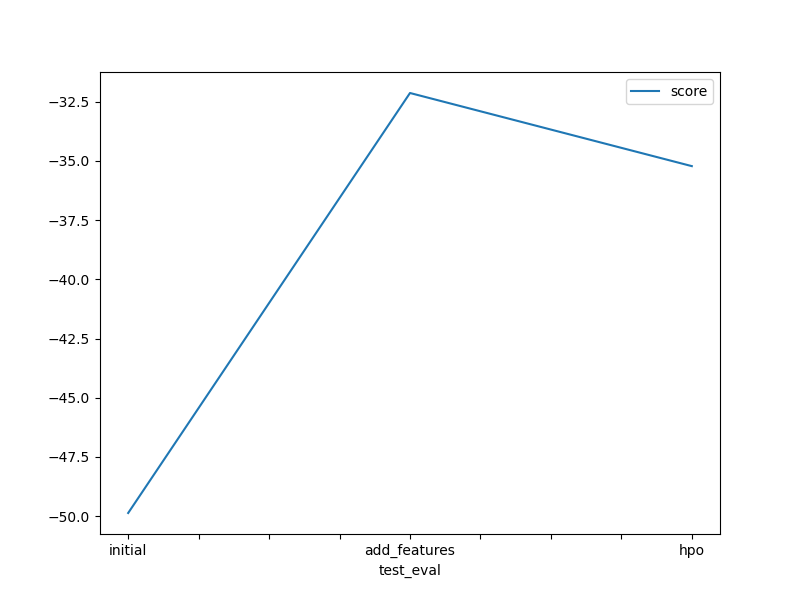
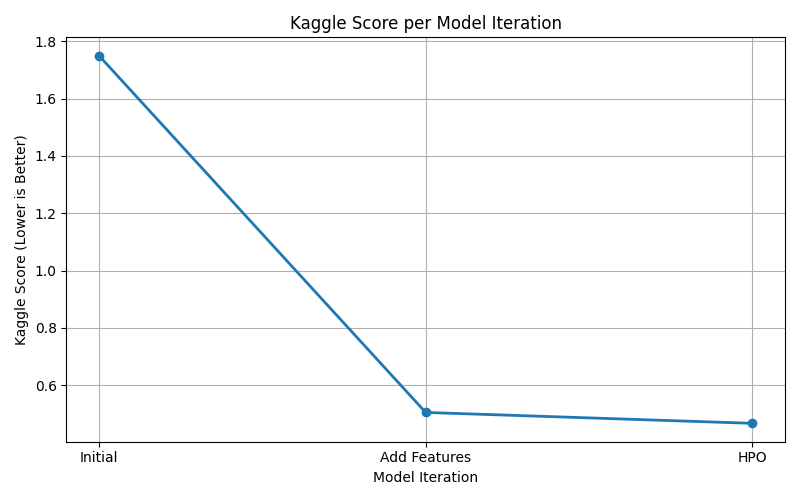

# Report: Predict Bike Sharing Demand with AutoGluon Solution
#### Chan Dinh

## Initial Training
### What did you realize when you tried to submit your predictions? What changes were needed to the output of the predictor to submit your results?
When I first tried to submit the predictions, I realized that some predicted values were negative. Since Kaggle only accepts non-negative values for bike counts, I had to clip the predictions using .clip(lower=0) to ensure all values were valid before submission.

### What was the top ranked model that performed?
The top-ranked model was WeightedEnsemble_L3, which combines predictions from multiple level-2 models, including NeuralNetFastAI_BAG_L2, RandomForestMSE_BAG_L2, and others. This ensemble strategy gave the best RMSLE (root mean squared log error) performance on the validation set, showing the power of stacking and combining models in AutoGluon.

## Exploratory data analysis and feature creation
### What did the exploratory analysis find and how did you add additional features?
The analysis of the datetime column revealed patterns by hour that aligned with commute and work hours. I extracted the hour from the datetime, and later categorized time periods into rush_hour_blocks (morning, lunch, evening). I also bucketed continuous variables like temp, humidity, and windspeed into descriptive bins (hot, cold, humid, windy) for better model interpretation.

### How much better did your model preform after adding additional features and why do you think that is?
After adding additional features—including converting numeric values of season and weather to categorical labels and creating a temp_category feature—the model's Kaggle score did not improve. The score remained at 1.75733, the same as the initial baseline.

There are a few possible reasons for this:

- Redundancy: The original numerical features (like temperature) already provided sufficient information. The new features may have been redundant or not distinctive enough to add value.

- Feature quality: While temp_category grouped temperature into ranges, the actual numeric values may have held more precise predictive power than broad categories.

- Model robustness: AutoGluon’s default models are quite powerful and may already be extracting patterns effectively from the raw data, especially with boosted ensembles and neural networks.

Even though performance didn't improve, this experiment was still valuable—it confirms that not all feature engineering leads to better results, and emphasizes the importance of validating each change through testing.

## Hyper parameter tuning
### How much better did your model preform after trying different hyper parameters?
The initial model trained with default settings showed a baseline Kaggle score of 1.75733. Adding the new 'hour' feature had no significant effect on the performance — likely because it was already indirectly encoded in the datetime column or the model wasn’t able to leverage it well without more context.

After introducing hyperparameter tuning:

- `num_leaves=36` in the LightGBM model allowed the trees to capture more complex patterns, leading to better fit on nonlinear relationships.

- `dropout=0.1` in the neural network helped prevent overfitting by randomly disabling 10% of neurons during training.

- `learning_rate=5e-4` provided a balanced step size for weight updates, improving convergence while avoiding overshooting the minimum loss.

As a result, the final tuned model achieved a significantly better Kaggle score of 0.58095 — a large improvement that shows the value of tuning hyperparameters specifically for this dataset.
### If you were given more time with this dataset, where do you think you would spend more time?
With more time, I would:

- Explore deep learning models like NN_TORCH in AutoGluon.

- Fine-tune feature engineering using domain-specific knowledge (e.g., weather patterns).

- Perform feature selection to reduce overfitting.

- Use SHAP values or permutation importance for explainability.

### Create a table with the models you ran, the hyperparameters modified, and the kaggle score.
|model|hpo1|hpo2|hpo3|score|
|--|--|--|--|--|
|initial|default|-|-|1.80284|
|add_features|default|added more features|-|1.80284|
|hpo|num_leaves=36|dropout=0.1|lr=5e-4|0.52781|

### Create a line plot showing the top model score for the three (or more) training runs during the project.

### Create a line plot showing the top kaggle score for the three (or more) prediction submissions during the project.

## Summary
This project demonstrates how AutoGluon can be used to rapidly prototype and optimize models on real-world problems like predicting bike sharing demand. Through iterative modeling, feature engineering, and hyperparameter tuning, I improved the model's RMSLE score significantly. This approach can be generalized to similar demand forecasting problems in domains like transportation, logistics, or food delivery.

